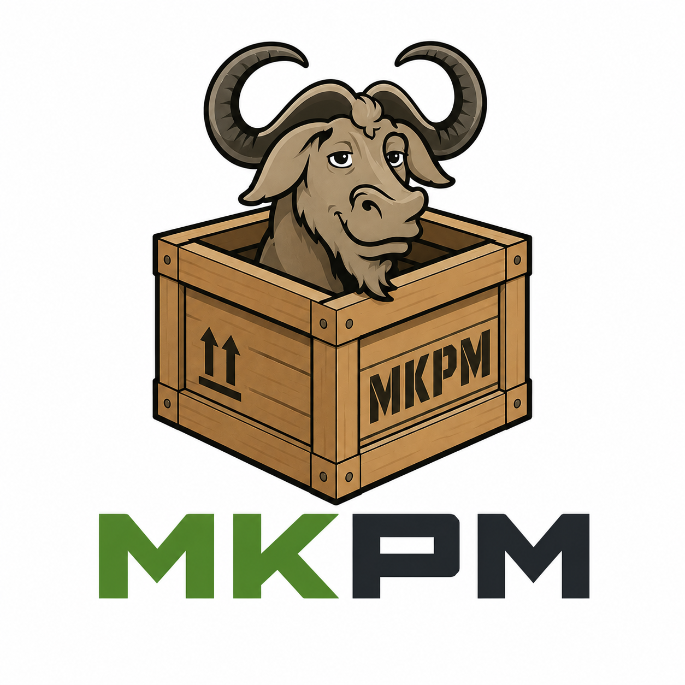

<p align="center">
  
</p>

[](https://github.com/USER/REPO/actions/workflows/ci.yml)

# MKPM - Make Package Manager
MKPM is a minimalist package manager for GNU Make. Rather than trying to be a general-purpose package manager, it provides a small, focused system with minimal dependencies for packaging and sharing Makefiles between projects within the same organization.

# Known Limitations
* Due to GNU Make's globally scoped variable, there's no elegant support for a medium to large size packaging system.
* Currently, package dependency resolution is simple and limited to exact semver matches.
* Windows is not tested / supported

# Getting Started
Run make -f <(curl -fsSL https://mkpm.io/bootstrap.mk) install

```bash
make -f <(curl -fsSL https://mkpm.io/bootstrap.mk) install
make -f <(curl -fsSL https://raw.githubusercontent.com/codextremist/mkpm/refs/heads/master/bootstrap.mk) install
tmp=$(mktemp) && curl -fsSL https://mkpm.io/Makefile -o "$tmp" && make -f "$tmp" install; rm -f "$tmp"
```

You'll be prompted to pick a registry for your packages. The easiest way to get started is picking Github Container Registry using your username or organization name. By default mkpm ships with a [ORAS](https://oras.land) client as a general artifact store. If you would like to use another registry you can implement your own by creating a new plugin.

# Creating a package

# Using local packages from a workspace
MKPM allows for the use of local packages through the use of a workspace. Much similar to NPMs workspace. Place a ws=<rel_or_abs_dir> on your .mkpmrc or .mkpmrc.local file.

# Loading packages
To load packages, just call anywhere in your file

```make
$(call mkpm_load,<package_name>)
```

# Design Decisions

* Maximize ubiquitiness and cross-platform compatibility by leveraging Make's own built-in features
* Core-functionality that depends on external depedencies should be implemented as plugins
* Due to GNU Make's lack of support of scoped variables, aim for small package sharing when namespace could be easily controlled by convention  